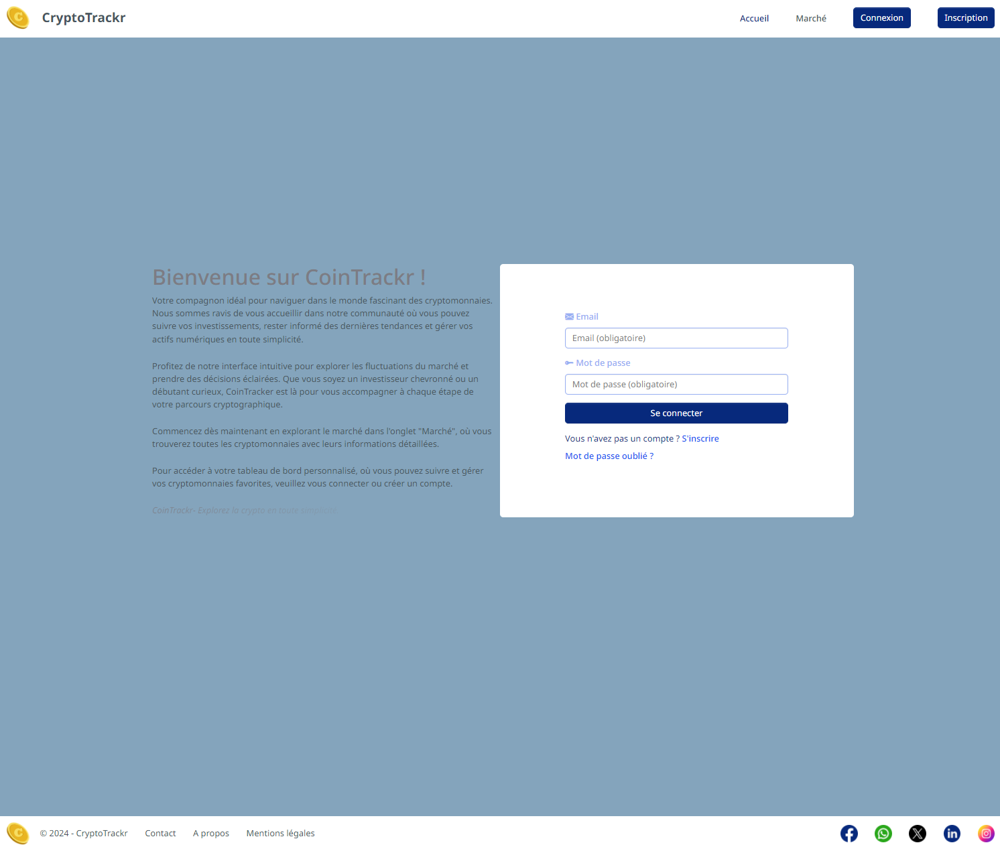
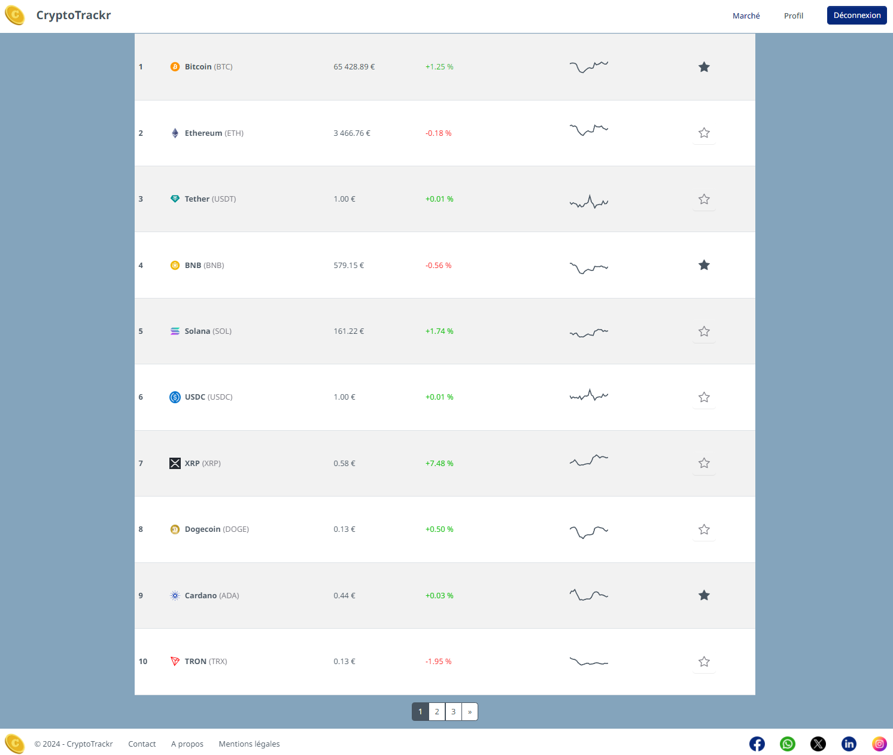
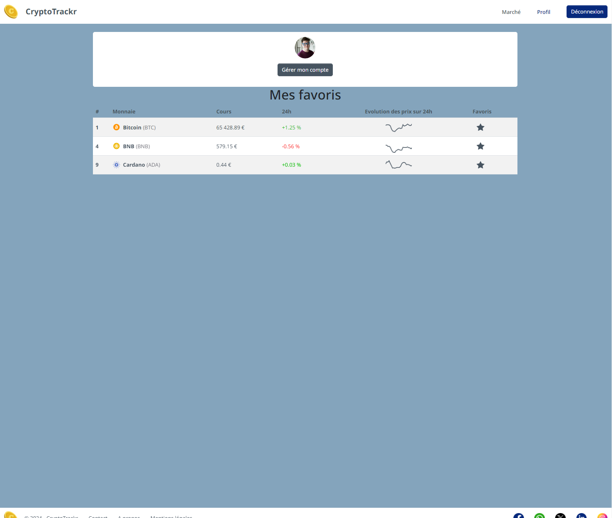
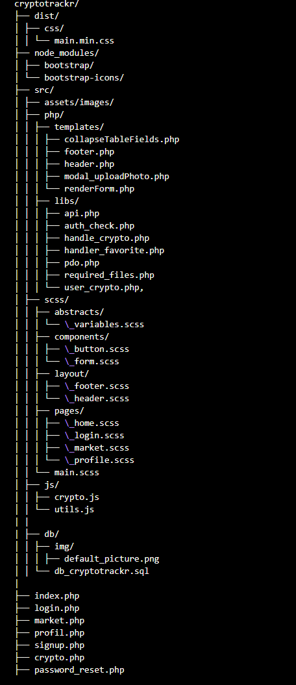

# CryptoTrackr

"Coin" (pour les cryptomonnaies) et "Tracker" (pour le suivi), indiquant clairement la fonction principale de l'application.


## Présentation



CryptoTrackr est une application web permettant de suivre facilement et rapidement l’évolution des cryptomonnaies. Les utilisateurs peuvent se connecter, créer un compte, et mettre en favoris les cryptomonnaies qui les intéressent le plus. L'application se distingue par son interface visuelle légère et sa personnalisation.


## Caractéristiques

- **Interface visuelle légère**
- **Responsive Design** : Adaptation pour les utilisateurs sur ordinateurs et appareils mobiles.
- **Interface de connexion/inscription**
- **Gestion des favoris** : Possibilité de mettre en favoris des cryptomonnaies
- **Suivi en temps réel** : Utilisation d’une API pour suivre les cours des cryptomonnaies
- **Graphiques interactifs** : Intégration de TradingView et Chart.js pour la visualisation des cours
- **Sécurité renforcée** : Procédures et outils mis en place pour sécuriser les données des utilisateurs

## Objectif

Le but de CryptoTrackr est de fournir une application complète et facile à utiliser pour le suivi des cryptomonnaies, avec une attention particulière à la sécurité des données utilisateurs et à une expérience utilisateur fluide et agréable.

## Fonctionnalités

### Pages

- **Page d'accueil (index.php)** : Invitation à se connecter ou créer un compte.
- **Page de création de compte (signup.php)** : Formulaire de création de compte avec validation des données.
- **Page profil (profil.php)** : Informations personnelles, photo de profil, modification et suppression du compte, liste des cryptomonnaies favorites avec cours et variation.
- **Page crypto (crypto.php)** : Détails d'une cryptomonnaie avec graphique du cours sur 24h et trading view.
- **Page market (market.php)** : Affiche le top 100 des crypto monnaies les plus performants.

### Sécurité

- **Protection des données** : Utilisation de techniques de hashage pour les mots de passe, validation et nettoyage des entrées utilisateur.
- **Connexion sécurisée** : Sessions sécurisées et gestion des tokens pour l'authentification.

### API

- Utilisation des API CoinCap et CryptoCompare pour récupérer les données des cryptomonnaies.

- Intégration de TradingView pour les graphiques interactifs.

## Technologies Utilisées

- **Frontend** : HTML, CSS (SCSS),Bootstrap, JavaScript
- **Backend** : PHP (PDO pour l'interaction avec la base de données)
- **Base de données** : MySQL
- **Graphiques** : Chart.js, TradingView
- **Sécurité** : Validation des entrées, hashage des mots de passe, gestion sécurisée des sessions

## Installation

1. **Cloner le dépôt GitHub** :
   ```bash
   git clone https://github.com/votre-utilisateur/cryptotrackr.git
   ```
2. **Naviguer dans le répertoire du projet** :

   ```bash
   cd cryptotrackr
   ```

3. **Importer la base de données SQL fournie dans db/db_cryptotrackr.sql en utilisant PhpMyAdmin ou une autre interface MySQL.** :

4. **Configurer les paramètres de la base de données dans src/php/libs/pdo.php** :
   $dsn = 'mysql:host=localhost;dbname=db_cryptotrackr';
    $user = 'votre-utilisateur';
   $pass = 'votre-mot-de-passe';

5. _Structure de base des fichiers du projet_



## Liens utiles

[_Wireframes, maquettes et prototypage =>_](https://www.figma.com/design/zeFi97NEhcCpNENx82QrKa/cryptotrackr?node-id=0-1&t=KsNsRX3pjsqvDBTH-1)

## Le présent projet est actuellement fonctionnel et prêt à l'emploi pour le suivi des cryptomonnaies. Cependant, le développement de _l'application mobile_ est prévu pour une phase ultérieure. Cette future version mobile permettra une synchronisation complète avec l'application web pour offrir une expérience utilisateur cohérente et fluide sur toutes les plateformes.
